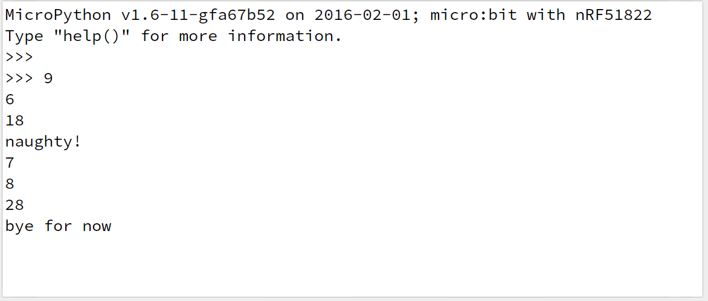

# Reaction timer - BBC micro:bit

## Introduction

This [MicroPython](https://microbit-micropython.readthedocs.io/en/latest/) software for the [micro:bit](http://microbit.org/) implements a simple reaction timer.

Output is via the serial port, so you can
1. Run it with [mu](https://github.com/mu-editor/mu) and use mu's REPL to display the results, or
1. Connect it to a [Raspberry Pi](https://www.raspberrypi.org/) or some other computer and do something interesting
with the output!

## What does it do?

1. The program starts by displaying a clock image.
1. Next, it picks a random time to wait, ranging from 500 ms to 4500 ms. 
1. When the time has run out it displays a happy face.
1. It waits to see how long you take to press **button a** on the micro:bit,
and prints the time in tenths of a second.
1. If you press **button a** *before* the happy face is displayed
it will tell you that you are naughty!
1. It loops back and starts again.

You can *quit* the program at any time by pressing **button b**.

Here's some sample output displayed in mu's REPL:

